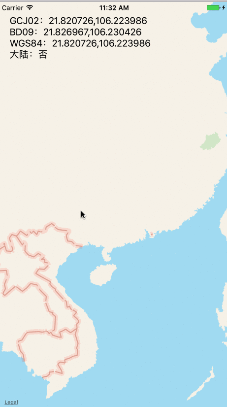
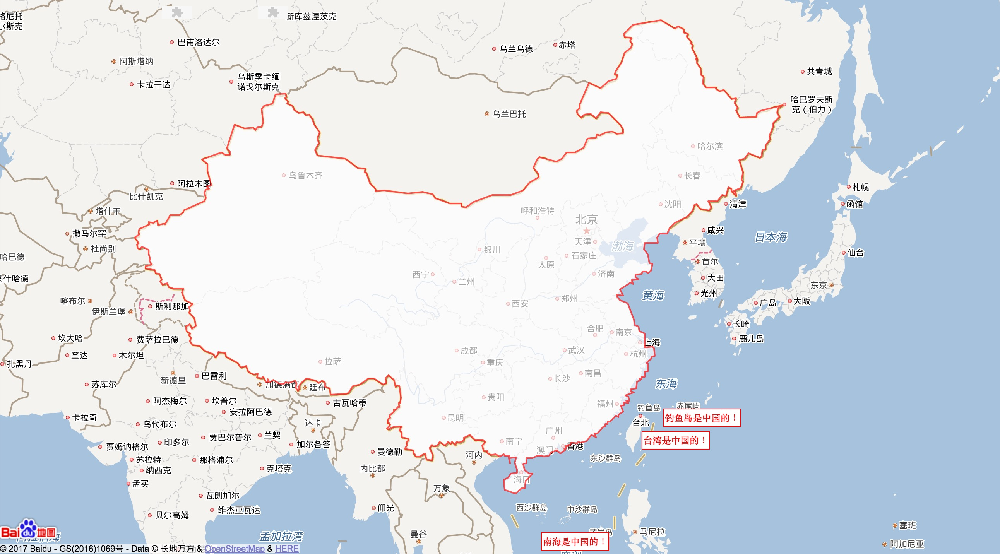

WGS-84世界标准坐标、GCJ-02中国国测局(火星坐标)、BD-09百度坐标系转换
===================

[](https://apple.com)
[](https://swift.org)
[](https://developer.apple.com/xcode)
[](https://github.com/Carthage/Carthage)
# Demo



# 使用

### 支持 [Carthage](https://github.com/Carthage/Carthage)，添加以下代码到你的Cartfile文件中:

```
github "JackZhouCn/JZLocationConverter-Swift"
```

## 1、在APP启动时加载[大陆边境线数据](#关于大陆边境线数据)：
```swift
    func application(_ application: UIApplication, didFinishLaunchingWithOptions launchOptions: [UIApplicationLaunchOptionsKey: Any]?) -> Bool {
        JZLocationConverter.start(filePath: Bundle(for:JZAreaManager.self).path(forResource: "GCJ02", ofType: "json")) { (error:JZFileError?) in
            if error != nil {
                print("失败")
            }else {
                print("成功")
            }
        }
        return true
    }

```
## 2、转换方法都在转换工具单例类内
```swift
    JZLocationConverter.default
```

## 3、目前有:
### WGS-84  -> GCJ-02 
### 此接口当输入坐标为中国大陆以外时，仍旧返回WGS-84坐标
```swift
    public func wgs84ToGcj02(_ wgs84Point:CLLocationCoordinate2D,result:@escaping (_ gcj02Point:CLLocationCoordinate2D) -> Void)
```
### GCJ-02  -> WGS-84
### 此接口有1-2米左右的误差，需要精确的场景慎用
```swift
    public func gcj02ToWgs84(_ gcj02Point:CLLocationCoordinate2D,result:@escaping (_ wgs84Point:CLLocationCoordinate2D) -> Void)
```
### WGS-84  -> BD-09
```swift
    public func wgs84ToBd09(_ wgs84Point:CLLocationCoordinate2D,result:@escaping (_ bd09Point:CLLocationCoordinate2D) -> Void)
```
### BD-09     -> WGS-84
```swift
    public func bd09ToWgs84(_ bd09Point:CLLocationCoordinate2D,result:@escaping (_ wgs84Point:CLLocationCoordinate2D) -> Void) 
```
## GCJ-02   -> BD-09
```swift
    public func gcj02ToBd09(_ gcj02Point:CLLocationCoordinate2D,result:@escaping (_ bd09Point:CLLocationCoordinate2D) -> Void)
```
### BD-09     -> GCJ-02
### 此接口有1-2米左右的误差，需要精确的场景慎用
```swift
    public func bd09ToGcj02(_ bd09Point:CLLocationCoordinate2D,result:@escaping (_ gcj02Point:CLLocationCoordinate2D) -> Void)
```
# 关于大陆边境线数据
### 1、默认的边境线数据位于项目的GCJ02.json文件中

### 2、默认的边境线数据来自「百度地图」API并转换到GCJ02

### 3、如果你需要使用自己的边境线数据（需要GCJ02坐标），只需要在[启动](#1%E5%9C%A8app%E5%90%AF%E5%8A%A8%E6%97%B6%E5%8A%A0%E8%BD%BD%E8%BE%B9%E5%A2%83%E7%BA%BF%E6%95%B0%E6%8D%AE)时加载自己的数据即可

### 4、默认的大陆边境线数据范围


